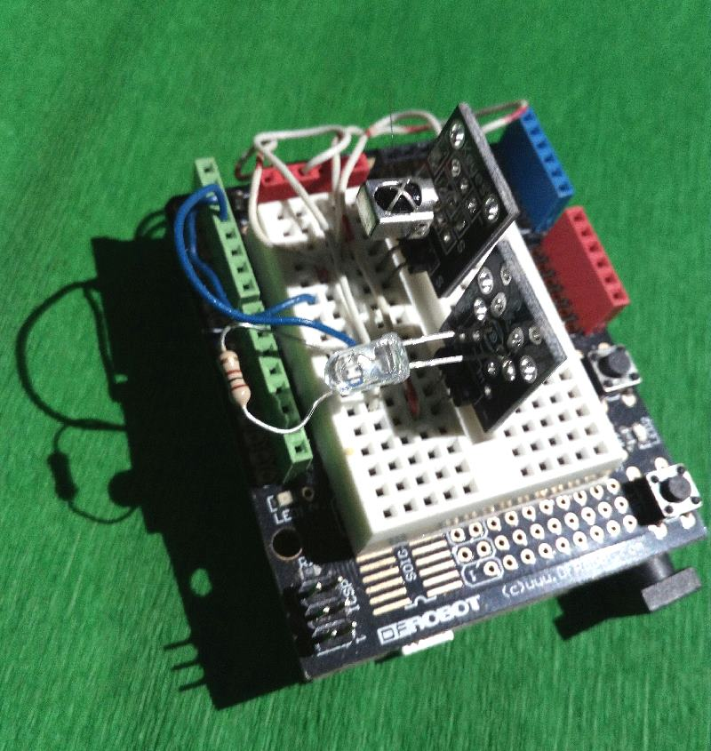

# irp_classes
This php classe implements the core algorithms required for working with IR remote controls, i.e. encode and decode RAW IR commands, 
using informations about the IR protocol in 'IRP notation'. 
The irp_classes is an 'execution process' for IRPs, extended to encode and decode processes of IR raw streams. 

In this library you also found some methods to handle RAW data streams, without IRP, for 'learn and repeat' applications. 
irp_classes was designed to help me (and you) to build good applications using IR Remote Control, like media home automation,
with known IRPs and not for analysing or reverse-engineering unknown IR protocols, because for that are many better applications
(IRremote, IrScrutinizer etc..). 

The global desing is different from usual: Arduino (or other hardware) does only very simple tasks: to receive and to transmit RAW IR signals. All the work is done on PHP, and it is universal, based on IRPs, no size or protocols limits. The irp_class can be used with a big database in WAMP environment, as I do in remotesDB (https://github.com/msillano/remotesDB),  library and demo application for replica of any IR remote control (air condioners included).

To store and retrieve IR commands you have many options:
- RAW: big size but fast, car it not requires IRP or processing (format like RAW-0 or any compressed version: RAW-1,RAW-2)
- HEX: small, but requires an IRP (format like BIN-1 or BIN-2)
- DATA SET: smallest and significant (like {D=7,F=0x3F}) 

With this library you have also 2 test pages:
1. Test cases for the library irp_classes: encode + decode. This test don't requires hardware. It produces a RAW IR stream, then decodes it. See examples/example_Fujitsu_aircon_modified_test.pdf.
2. (receive) + decode and analyse test. This demo can run with capturing HW (Arduino) or it can use some recorded IR RAW data. See examples/example_NEC1_decode.pdf. 

Arduino: the HW schema and the Arduino sketch can be found in the dir 'Arduino'

LIMITS (with Arduino uno Rev.3)
 -  Raw stream receive precision = +/-  2 microseconds
 -  Raw transmit frequencies:  30KHz - 57 KHz
 -  Raw receive buffer size: 300
 -  Raw transmit: 300

INSTALLATION

Copy all in web area of your WAMP server: e.g. ' ...\apache\htdocs\www\phpIRPlib'.

optional:
If you have Arduino-uno and an IR receiver:
     -  See the dir Arduino

optional:
Serial communications php-Arduino in windows:
    -  Download and install 'PHP Serial extension' free from http://www.thebyteworks.com (with some limits).

note:
If you have some different IR HW, modify irp_rxtxArduino.php to receive RAW data from your HW.

